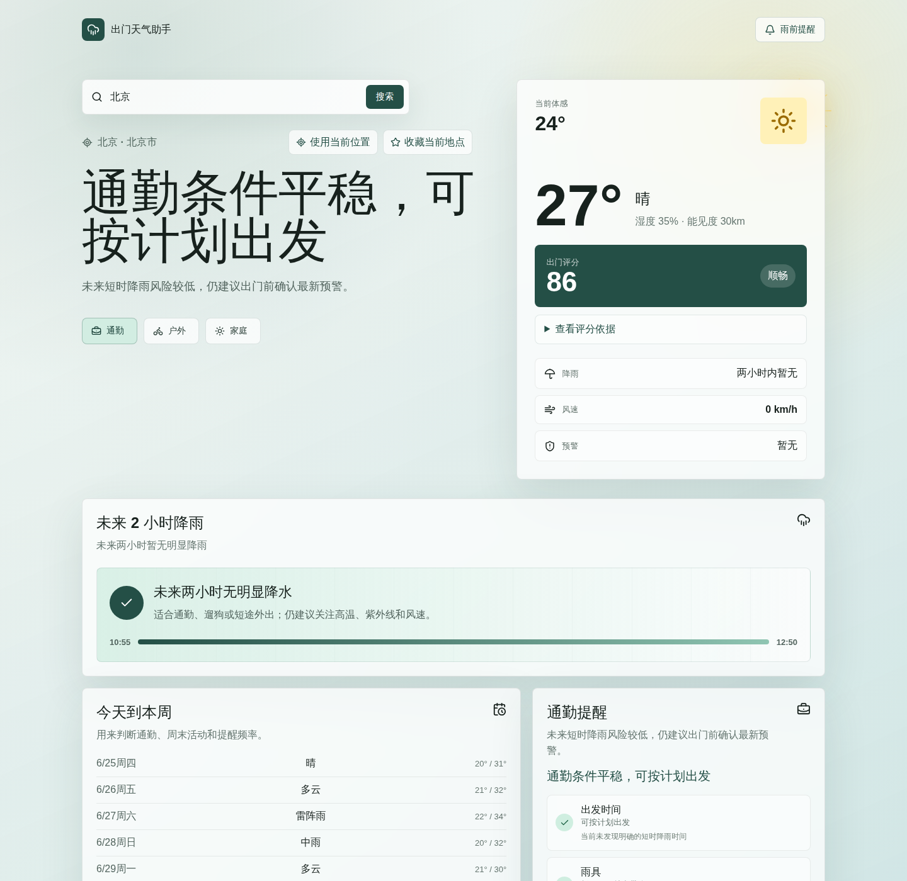

<div align="center">

# Weather Pro

### Weather you can act on before you walk out the door

Realtime conditions, minute-level rain, warnings, and lifestyle indices—turned into clear advice for commuting, outdoor activities, and family plans.

[简体中文](./README.md) · [Quick Start](#-quick-start) · [Deployment](./docs/deployment.md) · [Contributing](./CONTRIBUTING.md)

[](https://github.com/xuehaoweng/weather_help/actions/workflows/ci.yml)
[](./LICENSE)
[](https://nodejs.org/)
[](https://github.com/xuehaoweng/weather_help/stargazers)

If Weather Pro helps you, consider giving it a Star so more people can find it.

</div>



## Why Weather Pro?

Most weather apps give you numbers. Weather Pro focuses on the decisions behind them: **Do I need an umbrella? What should I wear? When should I leave? Is today good for a run, a ride, or a family trip?**

- **Decide at a glance** with actionable guidance built from temperature, rain, wind, warnings, and lifestyle indices
- **See the next two hours** with minute-level precipitation trends
- **Get genuinely different scenario advice** for commuting, outdoor activities, and family plans
- **Enable local rain reminders** with a location, lead time, and active hours
- **Use current and favorite locations** with up to five places stored locally
- **Understand the score** through weather penalties, source, and update time
- **Try it without an account** using the built-in Mock mode
- **Keep credentials server-side** behind an Express API proxy
- **Deploy simply** with a production build or Docker Compose

## 🚀 Quick Start

Node.js 20 or newer is recommended.

```bash
git clone git@github.com:xuehaoweng/weather_help.git
cd weather_help
npm install
cp .env.example .env
npm run dev
```

Open [http://localhost:5177](http://localhost:5177). Mock data is enabled by default, so no QWeather account or API key is required.

## Features

| Feature | What it helps you decide |
| --- | --- |
| Realtime weather and feels-like temperature | What it actually feels like outside |
| Minute-level precipitation for the next 2 hours | Whether to take an umbrella |
| 7-day and 24-hour forecasts | How to plan commutes and activities |
| Weather warnings and lifestyle indices | How to avoid weather-related risks |
| City and district search | What conditions look like at your destination |
| Commute / Outdoor / Family modes | Different departure, activity, and family guidance |
| Local rain reminders | Browser or in-page warnings while the app is open |
| Current and favorite locations | Fast switching between frequently used places |
| Explainable weather score | Rain, wind, UV, source, and freshness details |
| Skeleton states and progressive loading | Get the key conclusion sooner on slow networks |

## Local Rain Reminders

Open “Rain reminder” to choose a location, a 10/20/30-minute lead time, and active hours. Weather Pro requests notification permission only after an explicit click.

> [!NOTE]
> This is a local MVP. It checks rain every five minutes while the page is open and again when the page becomes visible. Reminders are not guaranteed after the browser closes; background Web Push and cross-device sync remain on the Roadmap.

## Use Real QWeather Data

Create a project and server-side credential at [QWeather Developers](https://dev.qweather.com/), then edit `.env`:

```bash
QWEATHER_MOCK=false
QWEATHER_PROJECT_ID=your_project_id
QWEATHER_CREDENTIAL_ID=your_credential_id
QWEATHER_API_KEY=your_api_key
QWEATHER_API_HOST=devapi.qweather.com
QWEATHER_GEO_HOST=geoapi.qweather.com
PORT=8787
```

Restart `npm run dev`. See the [QWeather setup guide](./docs/qweather-setup.md) for details.

> [!IMPORTANT]
> Never commit `.env` or expose your API key in frontend code. For public deployments, configure access restrictions and consider a dedicated QWeather API host or JWT authentication.

## Docker

```bash
cp .env.example .env
docker compose up --build
```

Open [http://localhost:8787](http://localhost:8787). See the [deployment guide](./docs/deployment.md) for production details.

## Architecture

```text
React + Vite frontend
        │
        │  /api/*
        ▼
Express API proxy ── cache / aggregation / scenario advice
        │
        │  server-side credentials
        ▼
QWeather API (or built-in Mock data)
```

## Commands

| Command | Purpose |
| --- | --- |
| `npm run dev` | Start the API and web development servers |
| `npm run dev:mock` | Force built-in Mock data |
| `npm test` | Run frontend and backend unit tests |
| `npm run build` | Build the production frontend |
| `npm run start` | Serve the production build and API with Express |

## Roadmap and Contributing

PWA support, background Web Push, cross-device sync, shareable weather cards, and more outdoor scenarios are on the [Roadmap](./ROADMAP.md).

Contributions are welcome. Please read the [contribution guide](./CONTRIBUTING.md), run `npm test` and `npm run build`, then open a focused pull request. Report vulnerabilities according to the [security policy](./SECURITY.md).

## License

[MIT](./LICENSE) © Weather Pro contributors

<div align="center">

**Fewer weather surprises, every time you head out.**

[Star Weather Pro](https://github.com/xuehaoweng/weather_help)

</div>
