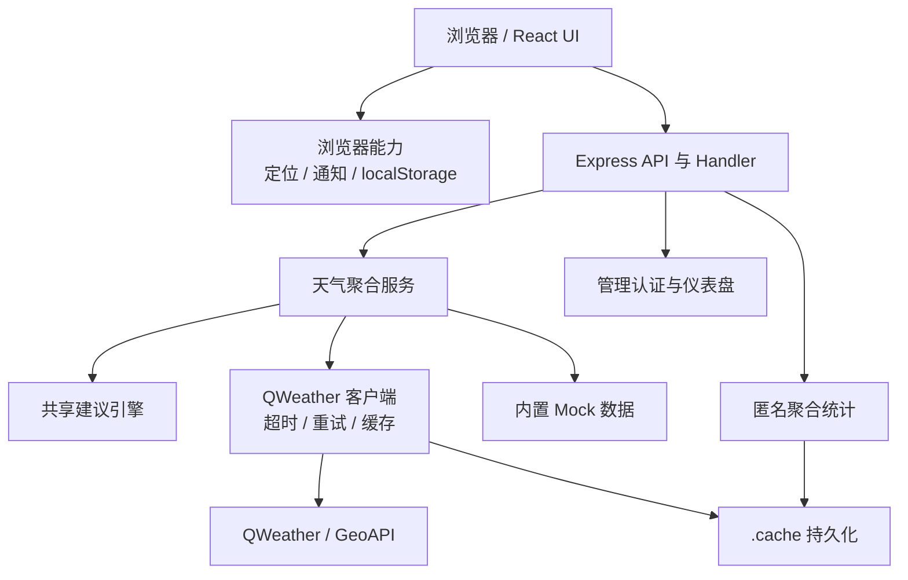
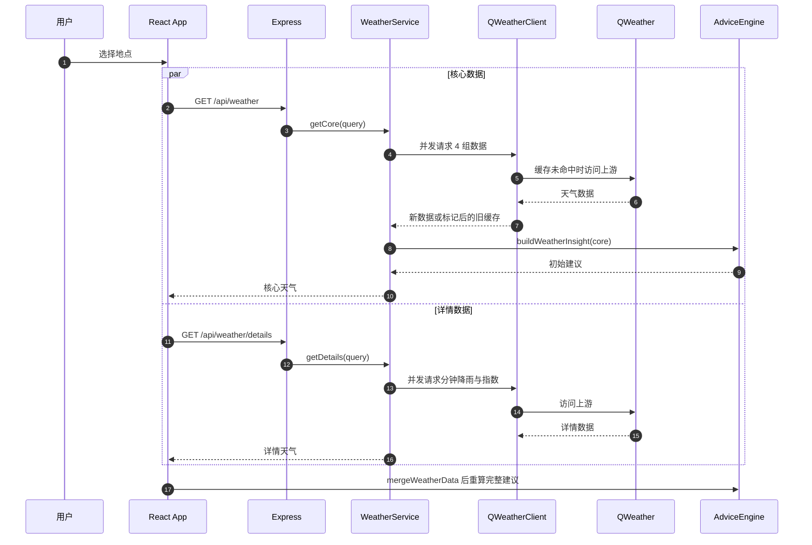
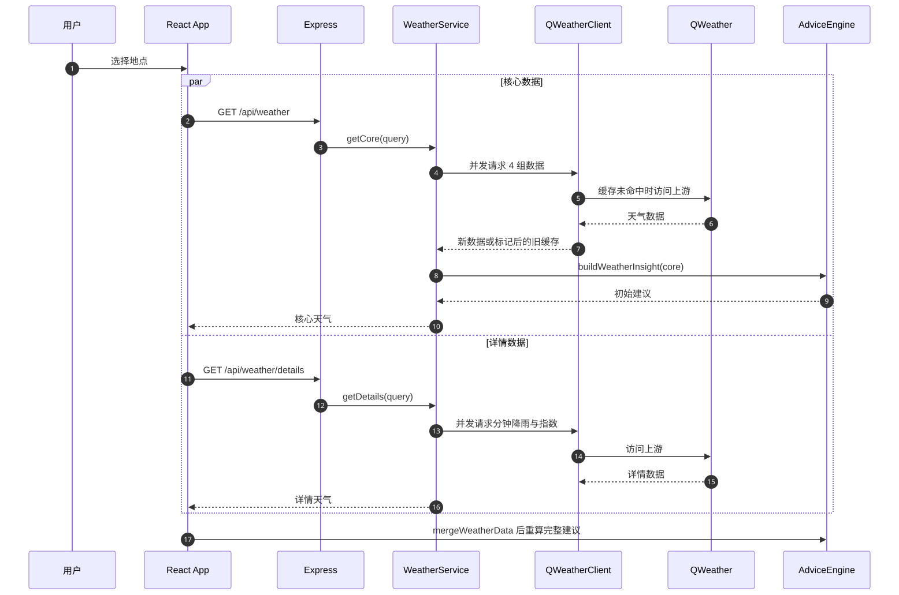

# 项目概述

## 引用源码文件

- `file:///root/weather_pro/package.json`
- `file:///root/weather_pro/vite.config.js`
- `file:///root/weather_pro/index.html`
- `file:///root/weather_pro/Dockerfile`
- `file:///root/weather_pro/server/index.js`
- `file:///root/weather_pro/server/app.js`
- `file:///root/weather_pro/server/weather-service.js`
- `file:///root/weather_pro/server/qweather-client.js`
- `file:///root/weather_pro/server/mock-data.js`
- `file:///root/weather_pro/server/admin-auth.js`
- `file:///root/weather_pro/server/analytics-store.js`
- `file:///root/weather_pro/shared/advice-engine.js`
- `file:///root/weather_pro/src/main.jsx`
- `file:///root/weather_pro/src/weather-loader.js`
- `file:///root/weather_pro/src/weather-effects.js`
- `file:///root/weather_pro/src/WeatherEffects.jsx`
- `file:///root/weather_pro/src/analytics-client.js`
- `file:///root/weather_pro/src/favorite-locations.js`
- `file:///root/weather_pro/src/reminder-engine.js`
- `file:///root/weather_pro/src/reminder-notifier.js`
- `file:///root/weather_pro/src/reminder-store.js`

## 1. 文档定位

Weather Pro 是一个 React、Vite 与 Express 组成的同仓全栈天气助手。它不只呈现实时天气、7 天与 24 小时预报、分钟降雨、天气预警和生活指数，还通过共享建议引擎生成「通勤、户外、家庭」三类行动建议。前端只访问同源 `/api/*`，QWeather 凭据由服务端持有。

源码出处：file:///root/weather_pro/package.json#L1-L33；file:///root/weather_pro/src/main.jsx#L227-L244；file:///root/weather_pro/server/index.js#L14-L35

## 2. 源码范围与实际边界

当前工作树的产品源码分成 `src/`、`server/` 和 `shared/`。`src/` 是浏览器界面与浏览器本地能力；`server/` 是 API、上游天气访问、缓存、Mock、管理认证和聚合统计；`shared/` 是前后端共同调用的纯决策逻辑。`public/` 是静态资源，`docs/` 是既有运维文档，`.worktrees/`、`node_modules/`、`dist/` 和 `.cache/` 不属于当前源码分层。

该仓库不存在独立的「Skills 系统层」或多个可发布子库；最接近子库的单元是无框架依赖的 `shared/advice-engine.js`。API 也不是第三方 API 的简单透传，而是带并发聚合、部分成功、评分重算和公共错误收敛的应用服务。

源码出处：file:///root/weather_pro/shared/advice-engine.js#L1-L48；file:///root/weather_pro/server/weather-service.js#L5-L71；file:///root/weather_pro/src/weather-loader.js#L80-L100

## 3. 项目结构

```text
weather_pro/
├── src/                    # React 页面、组件、天气效果与浏览器本地功能
│   └── components/         # 可复用展示组件
├── server/                 # Express 路由、聚合服务、上游客户端与基础设施
├── shared/                 # 前后端共享的评分和场景建议引擎
├── public/                 # 构建时原样复制的静态资源
├── docs/                   # 已有部署、QWeather 与设计文档
├── .github/workflows/      # CI
├── index.html              # Vite HTML 入口
├── vite.config.js          # 开发服务器与 /api 代理
├── Dockerfile              # 三阶段生产镜像
└── docker-compose.yml      # 单服务容器编排
```

`index.html` 将 `/src/main.jsx` 作为浏览器入口；`main.jsx` 根据 URL 是否以 `/admin` 开头选择用户端 `App` 或 `AdminApp`。生产环境由 Express 同时托管 `dist/` 和 API。

源码出处：file:///root/weather_pro/index.html#L1-L13；file:///root/weather_pro/src/main.jsx#L615-L616；file:///root/weather_pro/server/app.js#L80-L85

## 4. 分层架构





图表来源：file:///root/weather_pro/src/main.jsx#L67-L108；file:///root/weather_pro/server/index.js#L21-L60；file:///root/weather_pro/server/app.js#L31-L83；file:///root/weather_pro/server/weather-service.js#L25-L71

源码出处：file:///root/weather_pro/server/index.js#L21-L60；file:///root/weather_pro/server/app.js#L7-L85；file:///root/weather_pro/src/main.jsx#L67-L108

## 5. 核心组件

| 组件 | 职责 | 关键公开入口 |
| --- | --- | --- |
| React 应用 | 地点搜索、渐进天气加载、三场景切换、提醒调度 | `App`（模块内） |
| `createLatestWeatherLoader` | 并行请求核心与详情，取消旧地点请求，防止跨地点数据串写 | `load`、`cancel` |
| `createWeatherApp` | 装配 11 个 HTTP API 和生产静态托管 | Express app |
| `createWeatherService` | 把 6 组上游数据分为 core/details/full 聚合 | `getCore`、`getDetails`、`getFull` |
| `createQWeatherClient` | API Key 头、超时、两次重试、并发去重、内存/磁盘缓存和 stale-if-error | `request`、`close` |
| `buildWeatherInsight` | 评分、降雨摘要以及通勤/户外/家庭决策 | 单一纯函数 |
| `createAdminAuth` | scrypt 比对、失败限流、30 分钟空闲会话 | `login`、`verify`、`logout` |
| `createAnalyticsStore` | 每日聚合、匿名日活哈希、30 天保留和磁盘降级 | `record`、`overview`、`health`、`close` |

源码出处：file:///root/weather_pro/src/weather-loader.js#L3-L77；file:///root/weather_pro/server/app.js#L7-L85；file:///root/weather_pro/server/weather-service.js#L25-L71；file:///root/weather_pro/server/qweather-client.js#L21-L59；file:///root/weather_pro/shared/advice-engine.js#L3-L48

## 6. 天气调用链路





图表来源：file:///root/weather_pro/src/weather-loader.js#L7-L61；file:///root/weather_pro/server/app.js#L43-L44；file:///root/weather_pro/server/weather-service.js#L31-L68；file:///root/weather_pro/src/weather-loader.js#L80-L100

详情可以先返回，但加载器只有在同一代核心请求成功后才投递详情；地点变化会中止旧请求并增加 generation，从而防止旧响应覆盖新地点。

源码出处：file:///root/weather_pro/src/weather-loader.js#L3-L77；file:///root/weather_pro/src/weather-loader.js#L80-L100

## 7. 决策、展示与本机能力

建议引擎从 92 分起算，按预警、降雨、大风、极端温度和强 UV 扣分，将结果限制在 35–99。三个场景共用天气上下文，但分别输出出发时间/雨具/路上风险、活动安全/窗口/运动指数、家庭外出/防晒/穿衣参考。

前端将实时天气映射为晴、多云、阴、雷、雨、雪、雾、霾、沙尘等效果，并根据降水、风速、风向和移动端视口计算粒子数量与动画参数。收藏和提醒只写入 `localStorage`；提醒每 5 分钟以及页面重新可见时检查一次，通知权限不可用时退化为页内提示。

源码出处：file:///root/weather_pro/shared/advice-engine.js#L50-L202；file:///root/weather_pro/src/weather-effects.js#L41-L103；file:///root/weather_pro/src/main.jsx#L246-L291；file:///root/weather_pro/src/favorite-locations.js#L1-L41

## 8. 数据、认证与隐私

匿名统计只接受白名单事件：页面访问、城市选择、三类场景切换、提醒启停/发送和有限错误分类。服务端不接收任意属性，访客 ID 以「日期 + HMAC-SHA256」形成每日哈希，并只对外提供每日聚合。

管理后台仅在配置密码时启用；登录连续失败达到 5 次后默认封禁 15 分钟。会话只存内存、空闲 30 分钟过期，Cookie 使用 `HttpOnly`、`SameSite=Strict`，生产环境增加 `Secure`。服务重启会清空所有管理会话。

源码出处：file:///root/weather_pro/src/analytics-client.js#L1-L62；file:///root/weather_pro/server/app.js#L203-L227；file:///root/weather_pro/server/analytics-store.js#L20-L45；file:///root/weather_pro/server/analytics-store.js#L222-L234；file:///root/weather_pro/server/admin-auth.js#L7-L83

## 9. 依赖与运行分析

直接运行依赖只有 React、React DOM、Lucide React、Express、Vite、React Vite 插件和 concurrently。开发态由 concurrently 同时启动 API 与 Vite，Vite 将 `/api` 代理到 `127.0.0.1:8787`；生产态先构建 `dist/`，再由 `server/index.js` 启动单进程 Express。Dockerfile 使用 Node 22 Alpine 的 deps/build/runner 三阶段构建。

QWeather 客户端默认 4 秒超时，网络与超时错误最多重试 2 次；只为实时天气配置了 30 分钟 stale-if-error 窗口。磁盘缓存写入采用临时文件后 rename；持久化失败时服务继续以内存模式运行。

源码出处：file:///root/weather_pro/package.json#L6-L33；file:///root/weather_pro/vite.config.js#L4-L15；file:///root/weather_pro/Dockerfile#L1-L21；file:///root/weather_pro/server/qweather-client.js#L4-L7；file:///root/weather_pro/server/qweather-client.js#L61-L85；file:///root/weather_pro/server/qweather-client.js#L137-L180

## 10. 结论、风险与附录

Weather Pro 的主干设计是「渐进加载 + 服务端凭据 + 可解释建议 + 容错缓存」。它适合单实例自托管和本机提醒场景。边界也很明确：管理会话不跨进程共享；统计存储是单文件；浏览器关闭后雨前提醒无法保证；全量上游失败返回 502；实时旧缓存只覆盖配置了 stale-if-error 的数据源。

排查顺序建议为：

1. 访问 `/api/health` 确认 `mode`、API Key 布尔状态与统计开关。
2. 核心天气失败时检查 `/api/weather` 的 `error` 和 `errors`；详情单独检查 `/api/weather/details`。
3. 真实数据模式检查 `QWEATHER_API_KEY`、API Host、Geo Host 与服务端网络。
4. 管理后台 404 检查 `ADMIN_PASSWORD`，无统计数据检查 `ANALYTICS_ENABLED` 与 `ANALYTICS_HASH_SECRET`。
5. 通知未触发时确认页面仍打开、权限、激活时段、提前量以及 `lastNotificationKey` 去重状态。

源码出处：file:///root/weather_pro/server/app.js#L33-L78；file:///root/weather_pro/server/weather-service.js#L61-L68；file:///root/weather_pro/server/index.js#L18-L28；file:///root/weather_pro/src/reminder-engine.js#L8-L30
