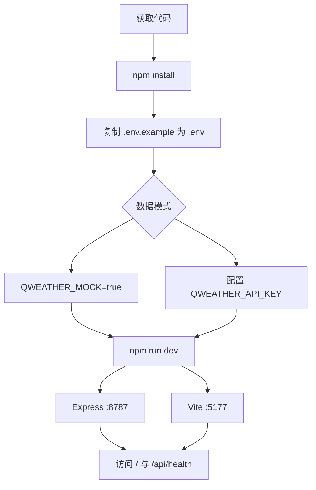

# 快速入门

## 引用源码文件

- `file:///root/weather_pro/package.json`
- `file:///root/weather_pro/.env.example`
- `file:///root/weather_pro/.github/workflows/ci.yml`
- `file:///root/weather_pro/vite.config.js`
- `file:///root/weather_pro/server/index.js`
- `file:///root/weather_pro/server/app.js`
- `file:///root/weather_pro/server/weather-service.js`
- `file:///root/weather_pro/server/qweather-client.js`
- `file:///root/weather_pro/server/admin-auth.js`
- `file:///root/weather_pro/src/main.jsx`
- `file:///root/weather_pro/Dockerfile`
- `file:///root/weather_pro/docker-compose.yml`

## 1. 入门目标

本指南面向第一次运行项目的开发者。完成后，你会在 Mock 模式下同时启动 Express API 和 Vite Web，打开天气助手，验证健康检查、地点搜索和天气接口；随后可选择切换真实 QWeather 或 Docker 运行。

源码出处：file:///root/weather_pro/package.json#L6-L15；file:///root/weather_pro/.env.example#L1-L17

## 2. 环境要求

项目声明为 ES Module，脚本直接使用 Node 内置测试器、全局 `fetch` 和 `AbortController`。CI 使用 Node 22；Docker 基础镜像也是 Node 22 Alpine，因此本地优先使用 Node 22。必须安装 npm；真实天气模式还需要 QWeather 服务端 API Key。

```bash
node --version
npm --version
```

源码出处：file:///root/weather_pro/package.json#L1-L6；file:///root/weather_pro/.github/workflows/ci.yml#L10-L19；file:///root/weather_pro/Dockerfile#L1-L12

## 3. 获取与安装

在项目根目录执行：

```bash
npm install
cp .env.example .env
```

`npm install` 安装 React、Express、Vite、Lucide React 和 concurrently。`.env.example` 默认设置 `QWEATHER_MOCK=true`，无需外部账号即可启动完整界面。

源码出处：file:///root/weather_pro/package.json#L20-L33；file:///root/weather_pro/.env.example#L1-L10

## 4. 配置最小环境

最小 `.env` 可以只有：

```dotenv
QWEATHER_MOCK=true
PORT=8787
```

启动器会先读取根目录 `.env`，已有进程环境变量优先；未提供 API Key 时也会自动进入 Mock 模式。Web 端开发端口固定为 5177，API 端口默认 8787。

源码出处：file:///root/weather_pro/server/index.js#L10-L20；file:///root/weather_pro/server/index.js#L81-L89；file:///root/weather_pro/vite.config.js#L6-L13

## 5. 启动流程




图表来源：file:///root/weather_pro/package.json#L6-L15；file:///root/weather_pro/vite.config.js#L4-L15；file:///root/weather_pro/server/index.js#L12-L18

运行：

```bash
npm run dev
```

`dev` 同时执行 `dev:api` 与 `dev:web`。也可用 `npm run dev:mock` 临时强制 Mock。

源码出处：file:///root/weather_pro/package.json#L6-L15

## 6. 验证 API

先检查：

```bash
curl -s http://127.0.0.1:8787/api/health
curl -s "http://127.0.0.1:8787/api/locations?q=北京"
curl -s "http://127.0.0.1:8787/api/weather?location=101010100&lon=116.40529&lat=39.90499"
curl -s "http://127.0.0.1:8787/api/weather/details?location=101010100&lon=116.40529&lat=39.90499"
```

Mock 健康响应应包含 `ok: true` 与 `mode: "mock"`。核心天气请求聚合实时、7 天、24 小时与预警；详情请求聚合分钟降雨与生活指数。

源码出处：file:///root/weather_pro/server/app.js#L33-L44；file:///root/weather_pro/server/weather-service.js#L5-L14；file:///root/weather_pro/server/weather-service.js#L31-L40

## 7. 验证 Web 功能

打开 `http://localhost:5177`。Vite 会将 `/api` 代理到 API 服务。初始地点是北京；页面并行加载核心与详情，核心先成功即可解除首屏加载，详情到达后再合并并重算建议。

建议依次验证：搜索城市、切换通勤/户外/家庭、收藏地点、打开雨前提醒。`/admin` 默认显示「管理后台未启用」，因为空密码会关闭管理认证。

源码出处：file:///root/weather_pro/vite.config.js#L4-L15；file:///root/weather_pro/src/main.jsx#L32-L40；file:///root/weather_pro/src/main.jsx#L67-L108；file:///root/weather_pro/src/main.jsx#L344-L385；file:///root/weather_pro/server/admin-auth.js#L7-L18

## 8. 切换真实天气

修改 `.env`：

```dotenv
QWEATHER_MOCK=false
QWEATHER_PROJECT_ID=your_project_id
QWEATHER_CREDENTIAL_ID=your_credential_id
QWEATHER_API_KEY=your_api_key
QWEATHER_API_HOST=devapi.qweather.com
QWEATHER_GEO_HOST=geoapi.qweather.com
PORT=8787
```

重启 `npm run dev`。真正决定 Mock/真实模式的是 `QWEATHER_MOCK === "true"` 或 API Key 是否为空；项目 ID 与凭据 ID 目前只以布尔状态出现在健康信息中，实际上游请求通过 `X-QW-Api-Key` 请求头认证。

源码出处：file:///root/weather_pro/.env.example#L1-L10；file:///root/weather_pro/server/index.js#L14-L20；file:///root/weather_pro/server/index.js#L40-L44；file:///root/weather_pro/server/qweather-client.js#L105-L127

## 9. 测试、构建与 Docker

```bash
npm test
npm run build
npm run preview
```

生产运行：

```bash
NODE_ENV=production npm start
```

或使用：

```bash
docker compose up --build
```

生产模式下 Express 将 `dist/` 作为静态目录并保留同源 `/api/*`。Compose 将容器 8787 端口映射到宿主机 8787。

源码出处：file:///root/weather_pro/package.json#L6-L15；file:///root/weather_pro/server/index.js#L59-L64；file:///root/weather_pro/server/app.js#L80-L83；file:///root/weather_pro/docker-compose.yml#L1-L9

## 10. 故障排查与下一步

| 现象 | 检查项 |
| --- | --- |
| 5177 无法启动 | Vite 设置了 `strictPort: true`，检查端口占用 |
| 页面 API 失败 | 确认 8787 API 进程存在，开发代理目标正确 |
| 健康模式仍为 Mock | 检查 Key 是否为空、`.env` 是否加载、`QWEATHER_MOCK` 是否为 `true` |
| 真实天气返回 502 | 检查 API Key/Host、上游网络和服务端日志 |
| 分钟降雨失败但核心正常 | 详情组独立失败是允许的，单独请求 `/api/weather/details` |
| `/admin` 为未启用 | 配置 `ADMIN_PASSWORD`；要记录指标还需启用统计并设置哈希密钥 |

下一步阅读 [API 参考](./03-api-reference.md) 和 [开发者指南](./04-developer-guide.md)。

源码出处：file:///root/weather_pro/vite.config.js#L6-L13；file:///root/weather_pro/server/index.js#L18-L28；file:///root/weather_pro/server/app.js#L258-L269；file:///root/weather_pro/server/weather-service.js#L61-L68
