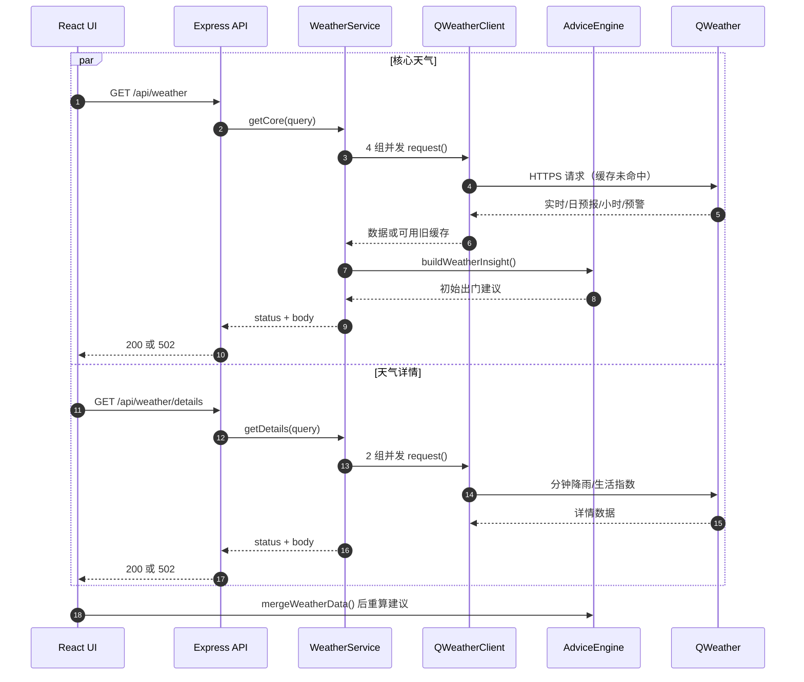
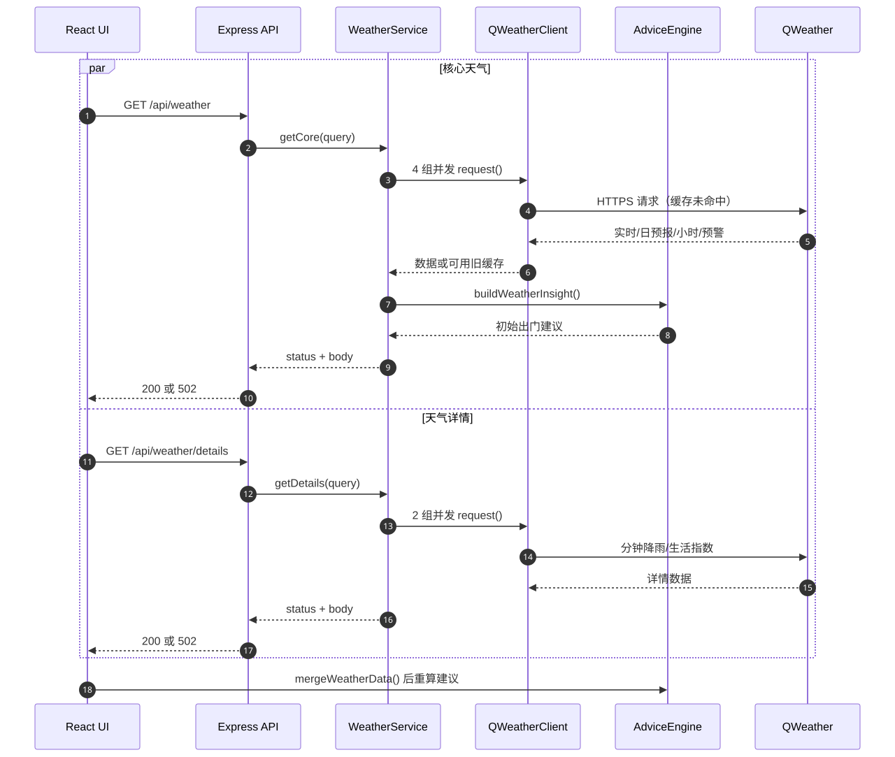

# API 参考

## 引用源码文件

- `file:///root/weather_pro/server/app.js`
- `file:///root/weather_pro/vite.config.js`
- `file:///root/weather_pro/server/index.js`
- `file:///root/weather_pro/server/weather-service.js`
- `file:///root/weather_pro/server/qweather-client.js`
- `file:///root/weather_pro/server/mock-data.js`
- `file:///root/weather_pro/server/admin-auth.js`
- `file:///root/weather_pro/server/analytics-store.js`
- `file:///root/weather_pro/shared/advice-engine.js`
- `file:///root/weather_pro/src/analytics-client.js`
- `file:///root/weather_pro/src/AdminApp.js`
- `file:///root/weather_pro/src/weather-loader.js`

## 1. 接口约定

所有浏览器请求使用同源 `/api`。除 204 响应外，接口返回 JSON。天气与地点输入错误统一为 400 `INVALID_LOCATION`；未处理的上游问题收敛为 502。生产态 API 和 Web 由同一 Express 实例提供，开发态由 Vite 代理。

源码出处：file:///root/weather_pro/server/app.js#L31-L85；file:///root/weather_pro/server/app.js#L251-L269；file:///root/weather_pro/vite.config.js#L9-L13

## 2. API 调用架构





图表来源：file:///root/weather_pro/src/weather-loader.js#L20-L61；file:///root/weather_pro/server/app.js#L43-L44；file:///root/weather_pro/server/weather-service.js#L31-L68；file:///root/weather_pro/server/qweather-client.js#L45-L85

源码出处：file:///root/weather_pro/server/weather-service.js#L25-L71；file:///root/weather_pro/src/weather-loader.js#L3-L100

## 3. 健康与地点

### `GET /api/health`

无参数，固定 200。响应包含 `ok`、`mode`、`apiHost`，并合入 `hasApiKey`、`hasProjectId`、`hasCredentialId`、`analyticsEnabled`。

### `GET /api/locations`

| 参数 | 必填 | 说明 |
| --- | --- | --- |
| `q` | 是 | 城市、区县、Location ID 或 `lon,lat` |
| `range` | 否 | 真实 GeoAPI 的地区范围，默认 `cn` |

空查询或非法坐标返回 400。Mock 模式按名称、行政区、ID 或拼音模糊匹配，坐标查询返回平方距离最近的内置城市；真实模式转发 GeoAPI，最多请求 8 项中文结果。

源码出处：file:///root/weather_pro/server/app.js#L33-L41；file:///root/weather_pro/server/app.js#L101-L122；file:///root/weather_pro/server/app.js#L190-L201；file:///root/weather_pro/server/index.js#L50-L57

## 4. 核心天气与完整天气

### `GET /api/weather`

| 参数 | 必填 | 默认/规则 |
| --- | --- | --- |
| `location` | 否 | 默认 `101010100` |
| `lon` | 否 | 必须与 `lat` 同时出现，范围 -180–180 |
| `lat` | 否 | 必须与 `lon` 同时出现，范围 -90–90 |
| `full` | 否 | 字符串 `"true"` 时请求全部 6 组数据 |

默认核心响应字段为 `location`、`point`、`errors`、`staleSources`、`now`、`daily`、`hourly`、`warning`、`insight`。`full=true` 额外包含 `minutely` 和 `indices`。部分上游失败仍返回 200 并把对应字段置为 `null`；全部失败返回 502 并增加顶层 `error`。

源码出处：file:///root/weather_pro/server/app.js#L43-L44；file:///root/weather_pro/server/app.js#L102-L103；file:///root/weather_pro/server/weather-service.js#L5-L14；file:///root/weather_pro/server/weather-service.js#L43-L68；file:///root/weather_pro/server/weather-service.js#L74-L89

## 5. 天气详情

### `GET /api/weather/details`

参数规则与 `/api/weather` 相同，但只并发请求：

- `minutely`：`/v7/minutely/5m`，使用 `lon,lat` 组成的 `point`，TTL 8 分钟。
- `indices`：`/v7/indices/1d`，类型为 `1,2,3,5,8,9,10,15`，TTL 60 分钟。

响应包含 `location`、`point`、`errors`、`staleSources`、`minutely`、`indices` 和详情级 `insight`。详情洞察只保证降雨摘要、首次降雨、最大降水、来源、更新时间与部分数据标志；前端合并核心数据后调用共享引擎生成完整场景建议。

源码出处：file:///root/weather_pro/server/weather-service.js#L11-L14；file:///root/weather_pro/server/weather-service.js#L35-L37；file:///root/weather_pro/server/weather-service.js#L91-L104；file:///root/weather_pro/server/weather-service.js#L138-L147；file:///root/weather_pro/src/weather-loader.js#L80-L100

## 6. 匿名统计事件

### `POST /api/analytics/events`

请求体：

```json
{
  "type": "scene_changed",
  "visitorId": "browser-generated-id",
  "properties": { "mode": "commute" }
}
```

允许的事件：

| 类型 | properties |
| --- | --- |
| `page_view`、`city_selected`、`reminder_enabled`、`reminder_disabled`、`notification_sent` | 必须为空对象 |
| `scene_changed` | 仅 `mode`: `commute` / `outdoor` / `family` |
| `client_error` | 仅 `category`: `weather_core` / `weather_details` / `notification` / `location` / `unknown` |

统计关闭时返回 204；合法事件返回 202 `{ "accepted": true }`；非法事件返回 400 `INVALID_ANALYTICS_EVENT`。存储失败会丢弃事件并仍返回接受，避免影响主流程。

源码出处：file:///root/weather_pro/server/app.js#L45-L49；file:///root/weather_pro/server/app.js#L123-L138；file:///root/weather_pro/server/app.js#L203-L227；file:///root/weather_pro/src/analytics-client.js#L1-L62

## 7. 管理登录与会话

### `POST /api/admin/login`

JSON 请求体包含 `username` 和 `password`。未配置管理员密码返回 404 `ADMIN_DISABLED`；错误凭据返回 401；达到失败阈值返回 429；成功返回 200 `{ "ok": true }` 并设置 `weather_admin` Cookie。

### `GET /api/admin/session`

固定返回 200，响应为 `{ enabled, authenticated }`，适合前端无错误探测后台状态。

### `POST /api/admin/logout`

启用时返回 204，删除内存会话并将 Cookie `Max-Age` 设为 0；未启用时返回 404。

源码出处：file:///root/weather_pro/server/app.js#L50-L70；file:///root/weather_pro/server/app.js#L139-L164；file:///root/weather_pro/server/admin-auth.js#L7-L71；file:///root/weather_pro/server/admin-auth.js#L74-L92

## 8. 管理数据

### `GET /api/admin/overview?range=7|30`

需要有效 Cookie。只有数值 30 选择 30 天，其余值统一为 7 天。返回 `days` 和汇总 `totals`，指标包括访问量、匿名日活、城市选择、场景、提醒与客户端错误。

### `GET /api/admin/health`

需要有效 Cookie。返回 `mode`、`startedAt`、`analytics` 健康状态，以及凭据/统计开关布尔值。统计关闭时，overview 仍返回全零结构。

未启用认证返回 404 `ADMIN_DISABLED`；会话无效返回 401 `ADMIN_UNAUTHORIZED`。

源码出处：file:///root/weather_pro/server/app.js#L71-L78；file:///root/weather_pro/server/app.js#L165-L185；file:///root/weather_pro/server/app.js#L230-L249；file:///root/weather_pro/server/analytics-store.js#L35-L54

## 9. 公共错误与容错语义

| HTTP | code | 触发条件 |
| --- | --- | --- |
| 400 | `INVALID_LOCATION` | 空地点、非法坐标、经纬度缺一 |
| 400 | `INVALID_ANALYTICS_EVENT` | 事件类型或属性不在白名单 |
| 401 | `INVALID_ADMIN_CREDENTIALS` / `ADMIN_UNAUTHORIZED` | 登录失败或会话无效 |
| 404 | `ADMIN_DISABLED` | 管理认证未配置 |
| 429 | `ADMIN_RATE_LIMITED` | 登录失败次数达到阈值 |
| 502 | `CORE_WEATHER_UNAVAILABLE` / `WEATHER_DETAILS_UNAVAILABLE` / `WEATHER_DATA_UNAVAILABLE` | 对应聚合组全部失败 |
| 502 | `UPSTREAM_NETWORK_ERROR` | Handler 捕获的其他上游异常 |

单个上游错误在 `errors[]` 中只暴露 `source`、归一化 `code` 与通用消息。QWeather 客户端内部还区分缺少 Key、超时、HTTP 错误、无效响应和网络错误。

源码出处：file:///root/weather_pro/server/app.js#L125-L150；file:///root/weather_pro/server/app.js#L230-L269；file:///root/weather_pro/server/weather-service.js#L118-L131；file:///root/weather_pro/server/qweather-client.js#L45-L46；file:///root/weather_pro/server/qweather-client.js#L88-L134

## 10. 调试附录

推荐从最小请求逐层定位：

```bash
curl -i http://127.0.0.1:8787/api/health
curl -i "http://127.0.0.1:8787/api/locations?q=116.40,39.90"
curl -i "http://127.0.0.1:8787/api/weather?location=101010100"
curl -i "http://127.0.0.1:8787/api/weather/details?location=101010100&lon=116.40&lat=39.90"
```

缓存键由完整 HTTPS URL 形成，包含 host、endpoint 和 query，但 API Key 只放在请求头，不进入缓存文件。相同 URL 的并发请求会复用一个 Promise；网络/超时错误可在实时天气的旧数据窗口内返回标记后的缓存。

源码出处：file:///root/weather_pro/server/qweather-client.js#L45-L74；file:///root/weather_pro/server/qweather-client.js#L105-L113；file:///root/weather_pro/server/qweather-client.js#L229-L259
