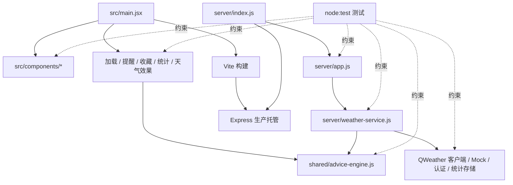

# 开发者指南

## 引用源码文件

- `file:///root/weather_pro/package.json`
- `file:///root/weather_pro/.env.example`
- `file:///root/weather_pro/.github/workflows/ci.yml`
- `file:///root/weather_pro/vite.config.js`
- `file:///root/weather_pro/src/main.jsx`
- `file:///root/weather_pro/src/AdminApp.js`
- `file:///root/weather_pro/src/weather-loader.js`
- `file:///root/weather_pro/src/weather-effects.js`
- `file:///root/weather_pro/src/WeatherEffects.jsx`
- `file:///root/weather_pro/src/reminder-engine.js`
- `file:///root/weather_pro/src/reminder-notifier.js`
- `file:///root/weather_pro/src/reminder-store.js`
- `file:///root/weather_pro/src/favorite-locations.js`
- `file:///root/weather_pro/src/analytics-client.js`
- `file:///root/weather_pro/src/components/CurrentConditions.js`
- `file:///root/weather_pro/src/components/LocationPicker.js`
- `file:///root/weather_pro/src/components/MobileSummary.js`
- `file:///root/weather_pro/src/components/ReminderSettings.js`
- `file:///root/weather_pro/src/components/ScenarioPanel.js`
- `file:///root/weather_pro/src/components/ScoreDetails.js`
- `file:///root/weather_pro/server/index.js`
- `file:///root/weather_pro/server/app.js`
- `file:///root/weather_pro/server/weather-service.js`
- `file:///root/weather_pro/server/qweather-client.js`
- `file:///root/weather_pro/server/mock-data.js`
- `file:///root/weather_pro/server/admin-auth.js`
- `file:///root/weather_pro/server/analytics-store.js`
- `file:///root/weather_pro/shared/advice-engine.js`
- `file:///root/weather_pro/server/qweather-client.test.js`
- `file:///root/weather_pro/server/weather-service.test.js`
- `file:///root/weather_pro/src/weather-loader.test.js`
- `file:///root/weather_pro/shared/advice-engine.test.js`

## 1. 开发目标与原则

本指南面向修改业务逻辑、前端交互、API 或基础设施的贡献者。代码采用函数工厂与依赖注入，使 fetch、时间、文件系统、定时器和随机数可替换测试。修改时应保持三项契约：前端只访问同源 API；天气组允许部分成功；决策输出能说明依据。

源码出处：file:///root/weather_pro/server/weather-service.js#L25-L30；file:///root/weather_pro/server/qweather-client.js#L21-L34；file:///root/weather_pro/server/admin-auth.js#L7-L15；file:///root/weather_pro/shared/advice-engine.js#L32-L47

## 2. 开发架构与依赖方向





图表来源：file:///root/weather_pro/src/main.jsx#L1-L30；file:///root/weather_pro/server/index.js#L1-L8；file:///root/weather_pro/server/weather-service.js#L1-L3；file:///root/weather_pro/package.json#L6-L15

源码出处：file:///root/weather_pro/src/main.jsx#L1-L30；file:///root/weather_pro/server/index.js#L1-L8；file:///root/weather_pro/server/weather-service.js#L1-L3

## 3. 本地开发工作流

```bash
cp .env.example .env
npm install
npm run dev:mock
npm test
npm run build
```

`npm test` 运行 `shared/`、`src/`、`src/components/`、`server/` 的全部 `*.test.js`。CI 当前只执行安装和构建，因此提交前本地测试不可省略。开发 Web 固定 5177；开发 API 默认 8787。

源码出处：file:///root/weather_pro/package.json#L6-L15；file:///root/weather_pro/.github/workflows/ci.yml#L10-L19；file:///root/weather_pro/vite.config.js#L4-L15

## 4. 修改天气数据链路

新增或调整上游数据源时：

1. 在 `CORE_SPECS` 或 `DETAIL_SPECS` 增加 source、endpoint 和 TTL。
2. 在 `resolveSpec` 明确 location、语言、单位或类型参数。
3. 在聚合结果的 insight builder 中读取新字段。
4. 同步 Mock payload，保证 Mock 与真实模式的外部形状一致。
5. 增加 service 测试，覆盖成功、部分失败和全部失败。

不要绕过 `Promise.allSettled`，否则单一数据源故障会破坏部分成功语义。只有可以安全降级的数据源才应配置 `staleIfErrorMs`。

源码出处：file:///root/weather_pro/server/weather-service.js#L5-L14；file:///root/weather_pro/server/weather-service.js#L43-L68；file:///root/weather_pro/server/weather-service.js#L91-L115；file:///root/weather_pro/server/mock-data.js#L27-L114

## 5. 修改共享建议引擎

`buildWeatherInsight` 是规则唯一入口。输入字段缺失时必须安全退化；输出至少保留 `title`、`score`、`scenarios`、降雨摘要、来源、更新时间和 `isPartial`。评分基础分为 92，扣分后限制到 35–99；场景决定项统一为 `{ key, status, label, value, reason }`。

由于服务端在 core/full 聚合后调用它，前端在 core + details 合并后再次调用它，任何输出形状变化都必须同时检查 UI 和 API。优先把新增规则写成纯计算，不读取浏览器或 Node 全局状态。

源码出处：file:///root/weather_pro/shared/advice-engine.js#L3-L67；file:///root/weather_pro/shared/advice-engine.js#L69-L202；file:///root/weather_pro/shared/advice-engine.js#L222-L227；file:///root/weather_pro/src/weather-loader.js#L80-L100

## 6. 修改 React 页面与组件

用户端状态与副作用集中在 `App`；纯展示拆到 `src/components/`。新组件应延续现有模式：通过 props 接收数据与回调，缺失数据展示明确空状态，不制造假值，并保留 `role`、`aria-label`、`aria-live` 等辅助语义。

天气加载必须继续使用 generation + AbortController 防止竞态。管理端由路径 `/admin` 选择 `AdminApp`，与用户端共用一个 Vite 入口；不要新增未被路由选择逻辑覆盖的独立 HTML 入口。

源码出处：file:///root/weather_pro/src/main.jsx#L42-L108；file:///root/weather_pro/src/main.jsx#L293-L398；file:///root/weather_pro/src/main.jsx#L615-L616；file:///root/weather_pro/src/components/CurrentConditions.js#L15-L64；file:///root/weather_pro/src/components/ScenarioPanel.js#L11-L47

## 7. 修改浏览器本地功能

收藏最多 5 个，存储键为 `weather-pro:favorites`；提醒配置带版本号并只允许 10/20/30 分钟提前量和合法 `HH:mm`。提醒判断使用上海时区、支持跨午夜激活窗口，并用 `location.id:firstRainAt` 去重。

通知模块只在权限为 `granted` 时调用浏览器 Notification，否则返回页内提示。统计客户端对事件与属性做第一次白名单过滤，服务端仍必须再次校验；不要把搜索词、坐标或任意错误文本加入统计属性。

源码出处：file:///root/weather_pro/src/favorite-locations.js#L1-L41；file:///root/weather_pro/src/reminder-store.js#L1-L55；file:///root/weather_pro/src/reminder-engine.js#L1-L64；file:///root/weather_pro/src/reminder-notifier.js#L1-L35；file:///root/weather_pro/src/analytics-client.js#L1-L62

## 8. 修改 API、认证与存储

路由层应保持薄：从 Express 读取 query/body/cookie，调用可独立测试的 handler，再映射 status/body。天气输入错误返回 400，意外上游错误返回 502。新增管理接口必须经过 `adminAccess`。

认证口令使用 scrypt 派生后做 timing-safe 比较，会话只存在内存。统计写盘和天气缓存都采用临时文件 + rename；写盘失败会降级，不应让天气或统计主流程崩溃。新增存储字段时需要 schema/version 策略。

源码出处：file:///root/weather_pro/server/app.js#L7-L85；file:///root/weather_pro/server/app.js#L88-L188；file:///root/weather_pro/server/app.js#L230-L269；file:///root/weather_pro/server/admin-auth.js#L24-L71；file:///root/weather_pro/server/analytics-store.js#L61-L118；file:///root/weather_pro/server/qweather-client.js#L137-L201

## 9. 测试与交付检查

现有测试契约包括：

- QWeather 并发去重、两次重试、超时、旧缓存、磁盘恢复和写失败降级。
- 天气 core/details/full 分组、部分失败、502 与坐标校验。
- 渐进加载缓冲、取消和旧响应不可写。
- 三类建议差异、评分因素、缺失数据退化。
- 提醒时间窗、跨午夜、去重和通知退化。
- 认证限流、会话/Cookie、统计隐私白名单与 30 天保留。
- React 组件空状态、无障碍标签和聚合后台展示。

交付前至少运行：

```bash
npm test
npm run build
node wiki/validate-wiki.mjs
```

源码出处：file:///root/weather_pro/package.json#L6-L15；file:///root/weather_pro/server/qweather-client.test.js#L15-L301；file:///root/weather_pro/server/weather-service.test.js#L8-L136；file:///root/weather_pro/src/weather-loader.test.js#L5-L149；file:///root/weather_pro/shared/advice-engine.test.js#L36-L107

## 10. 故障排查、约束与附录

常见开发错误：

- 新 source 已加入 service，但 Mock、insight 或 UI 未同步，导致模式间形状不一致。
- 直接在详情响应到达时写 UI，破坏同地点核心成功后才合并的约束。
- 在 analytics 事件中加入任意属性，被客户端或服务端白名单拒绝。
- 将管理会话或单文件统计误当作多实例共享状态。
- 在前端引用 API Key，破坏服务端凭据边界。
- 修改天气图标映射却未同步降水类型、最低强度与 Mock 场景测试。

源码附录：用户端入口在 `src/main.jsx`，API 装配在 `server/app.js`，运行时依赖注入在 `server/index.js`，天气聚合在 `server/weather-service.js`，上游韧性在 `server/qweather-client.js`，规则核心在 `shared/advice-engine.js`。

源码出处：file:///root/weather_pro/src/weather-loader.js#L26-L61；file:///root/weather_pro/server/app.js#L203-L227；file:///root/weather_pro/server/index.js#L30-L60；file:///root/weather_pro/src/weather-effects.js#L1-L35
